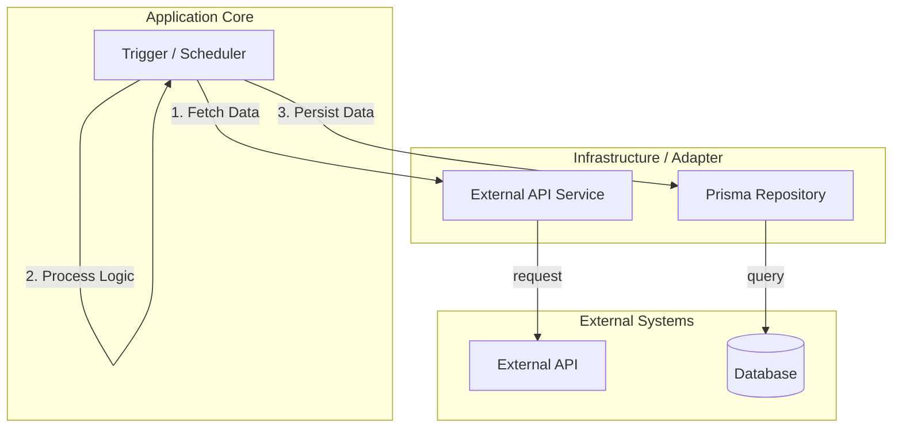
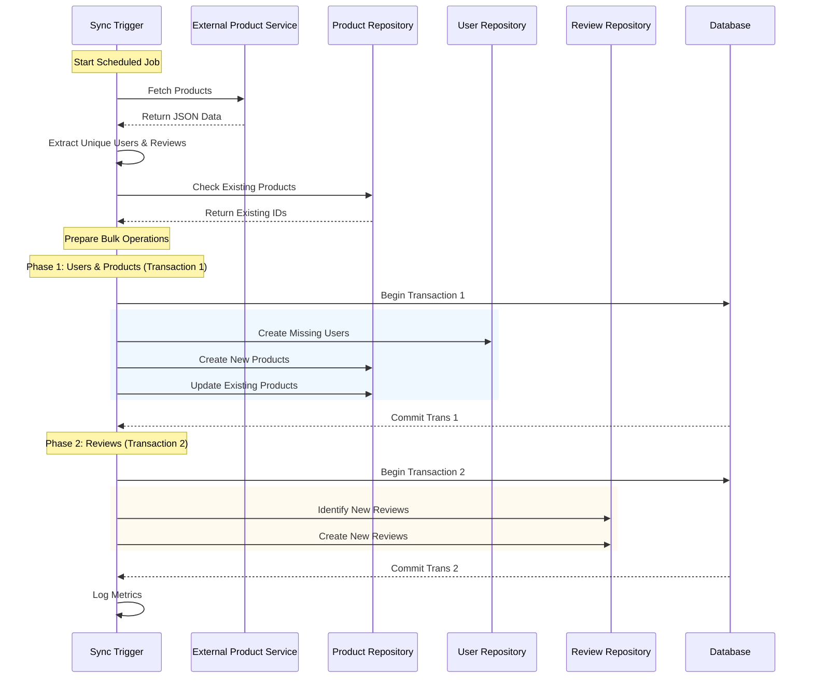
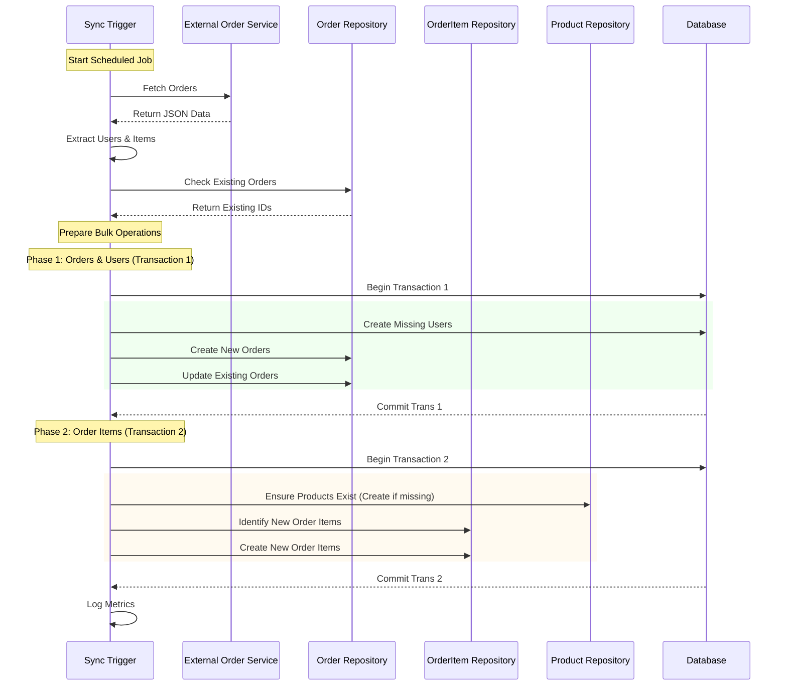

# Magpie Project

This is a [Next.js](https://nextjs.org) project designed with **Clean Architecture** principles to handle data synchronization tasks using [Trigger.dev](https://trigger.dev).

## Architecture Overview

This project follows a **Clean Architecture** approach to ensure separation of concerns, scalability, and maintainability. The code is organized into distinct layers:

### 1. **Trigger Layer (`/trigger`)**
   - **Role:** Entry point for scheduled tasks and event-driven workflows.
   - **Responsibility:** Orchestrates the flow of data. It fetches data using Services, processes business logic (like extracting users from orders), and persists data using Repositories.
   - **Clean Principle:** It does not contain low-level database queries or external API implementation details.

### 2. **Service Layer (`/lib/services`)**
   - **Role:** Interface with external systems.
   - **Responsibility:** specifically `@/lib/services/external`, handles communication with 3rd party APIs (fetching Products, Orders).
   - **Clean Principle:** Abstracts the external data source. If the API changes, only this layer needs updates.

### 3. **Repository Layer (`/lib/repositories`)**
   - **Role:** Data Access Layer.
   - **Responsibility:** Communicates directly with the database (using Prisma). Handles creating, updating, and querying records.
   - **Clean Principle:** The rest of the application doesn't need to know about Prisma or SQL.

### 4. **Domain/Types Layer (`/lib/types`)**
   - **Role:** Definitions of data structures.
   - **Responsibility:** Shared interfaces (like `ProductResponse`, `OrderResponse`) used across layers.

---

## Why this Architecture?

1.  **Maintainability:** Business logic in Triggers is clear and readable. "Fetch data", "Check existence", "Save to DB". No cluttered SQL queries inside the schedule logic.
2.  **Scalability:** We can easily add new sync tasks by reusing existing Repositories and Services.
3.  **Reliability:** By separating concerns, we can handle transactions and errors ("Atomic" operations) in the Application/Trigger layer without getting bogged down in implementation details.
4.  **Testability:** specific layers (like Repositories) can be tested in isolation or mocked when testing the Triggers.

---

## Sync Process Flow

The synchronization processes are handled by `trigger/sync_product.ts` and `trigger/sync_order.ts`. Below represents the flow of these operations.

### High-Level Architecture Diagram



### Sync Product Flow

The product sync ensures Users, Products, and Reviews are updated.



**Design Rationale:**
*   **Two-Phase Transaction Strategy:** We split the process into two separate transactions (\"Phases\") to match the order sync pattern and reduce database locking.
    *   **Phase 1 (Users & Products):** Commits the master data (Users and Products) first.
    *   **Phase 2 (Reviews):** Handles the dependent data (Reviews) that reference Users and Products.
*   **Master Data & Mutability:** Products are mutable entities (prices/names change). The system explicitly handles `Create` vs `Update`.
*   **Efficient Association:** Reviews are treated as an append-only stream (create usually), extracted and processed in bulk within the second transaction.

### Sync Order Flow

The order sync is slightly more complex as it handles Order Items and guarantees Product existence.



**Design Rationale:**
*   **Two-Phase Transaction Strategy:** We split the process into two separate transactions ("Phases") to reduce complexity and database locking.
    *   **Phase 1 (Orders):** Commits the "Order Headers" and "Users" first.
    *   **Phase 2 (Items):** Handles the heavier logic of ensuring referenced Products exist and creating Order Items.
*   **Strict Referential Integrity:** An Order Item *cannot* be inserted if the referenced Product ID doesn't exist. Phase 2 includes a dedicated checks to prevent Foreign Key crashes.

---

## Business Insights Feature

The **Business Insights** card is a key dashboard component designed to provide an immediate snapshot of the company's financial health. It combines two critical visualizations:

1.  **Revenue Performance**: A line/area chart tracking revenue over the current year compared to the previous year. This allows for quick YoY (Year-over-Year) growth analysis.
2.  **Top 5 Product Categories**: A list highlighting the best-selling product categories contributing the most to total revenue.

### How to use the "Switch" (Expand View)

To keep the dashboard clean, the insights card shows a compact view by default. However, you can "switch" to a detailed mode for deeper analysis:

*   **Expand Button**: Look for the expand icon (arrows) in the top-right corner of the Revenue Chart or the Category List.
*   **Detailed View**: Clicking this button opens a large **Modal Dialog**.
    *   **Revenue Layout**: In the modal, the revenue chart expands to show a Y-axis with specific dollar amounts, making it easier to read precise values.
    *   **Category Layout**: The category list expands to show more details or simply provides a focused view without dashboard clutter.
*   **Close**: Click outside the dialog or press Escape to return to the main dashboard.

---

## Getting Started

First, run the development server:

```bash
npm run dev
# or
yarn dev
# or
pnpm dev
# or
bun run dev
```

Open [http://localhost:3000](http://localhost:3000) with your browser to see the result.